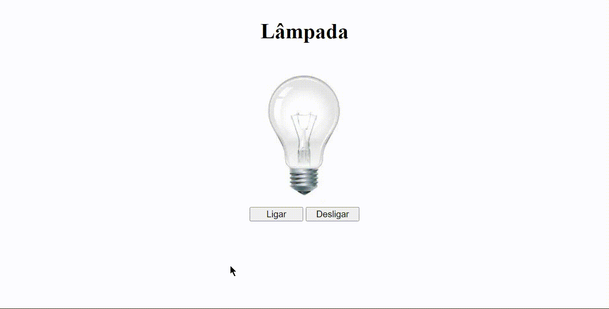

<h1 align="center">
    
</h1>

  

###  Sobre

**Projeto lâmpada**: Você clica no botão de ligar, a lâmpada vai acender, e se clica no botão de desligar, a lâmpada vai apagar. Passando o mouse em cima da lâmpada, ela vai acender. tirando o mouse de cima da lâmpada ela vai apagar. caso você clique duas vezes em cima da lâmpada, ela vai quebra

---
 
### 💻 Tecnologia utilizada

- HTML 5
- CSS 3
- JAVASCRIPT

---